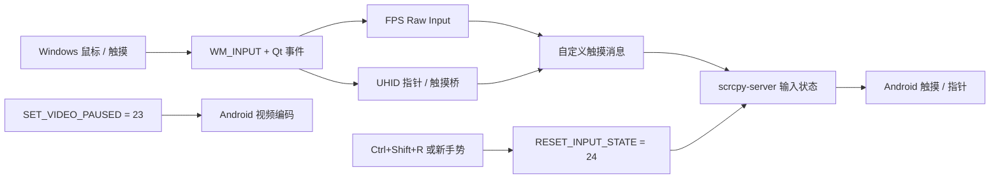

# QtScrcpy Custom v4.1 · Input Recovery Edition

<div align="center">

  <h3>把 Android 投屏变成一条可观测、可恢复、面向游戏输入的低延迟链路</h3>
  <p>
    <a href="https://github.com/clxiny/QtScrcpy-custom-build-v4.1-fps-250hz-rawinput/releases/latest">下载最新构建</a>
    ·
    <a href="https://github.com/clxiny/QtScrcpy-custom-build-v4.1-fps-250hz-rawinput/actions">查看构建</a>
    ·
    <a href="https://github.com/clxiny/QtScrcpy-custom-build-v4.1-fps-250hz-rawinput/issues">提交问题</a>
  </p>

  [](https://github.com/clxiny/QtScrcpy-custom-build-v4.1-fps-250hz-rawinput/releases)
  [](https://www.qt.io/)
  [](#输入链路)
  [](https://github.com/clxiny/QtScrcpy-custom-build-v4.1-fps-250hz-rawinput/actions/workflows/custom-windows-x64.yml)
  [](https://github.com/clxiny/QtScrcpy-custom-build-v4.1-fps-250hz-rawinput/releases)
  [](#许可证与上游声明)

</div>

> 这是一个面向 **Windows x64** 的 QtScrcpy v4.1 定制构建。它保留上游项目的投屏与控制能力，同时把 UHID 指针、游戏触摸桥接、Raw Input 高频鼠标和输入状态恢复组合成一条更适合桌面游戏场景的输入管线。

## 目录

- [项目定位](#项目定位)
- [功能矩阵](#功能矩阵)
- [输入链路](#输入链路)
- [输入状态恢复](#输入状态恢复)
- [快捷键与日志](#快捷键与日志)
- [快速开始](#快速开始)
- [分层按键可视化编辑器](#分层按键可视化编辑器)
- [Windows 构建包](#windows-构建包)
- [从源码构建](#从源码构建)
- [排障手册](#排障手册)
- [已知边界](#已知边界)
- [版本与校验](#版本与校验)
- [许可证与上游声明](#许可证与上游声明)

## 项目定位

QtScrcpy 是桌面端 Qt 客户端；scrcpy-server 是运行在 Android 设备上的服务端。这个仓库把两者按同一套自定义控制消息重新构建，并通过 GitHub Actions 生成可直接解压运行的 Windows x64 便携包。

本版本重点解决三个实际问题：

1. 高频鼠标报告在桌面事件层被重复处理，导致 FPS 操作抖动或延迟累积；
2. 系统指针、游戏触摸和屏幕坐标在旋转/分辨率变化后容易失去对齐；
3. Android 端的直接触摸可能取消电脑注入的触摸，留下“按键/视角失效”的残留状态。

它不是上游项目的官方发行版，也不隶属于上游作者；定制改动集中在 Windows 输入路径、坐标转换和 scrcpy-server 输入状态处理。

## 功能矩阵

| 子系统 | 上游基础能力 | 本版本增强 |
| --- | --- | --- |
| 投屏/控制 | USB 或网络连接、视频与控制通道 | 保持原有通道，增加视频暂停消息 |
| FPS 鼠标 | Qt/系统鼠标事件 | `WM_INPUT` Raw Input，避免系统加速与重复消费 |
| 高频输入 | 依赖桌面事件到达速度 | 首包立即发送，后续按 4 ms 合并，目标更新上限约 250 Hz |
| 系统指针 | 普通触摸控制 | UHID 绝对指针，按视频宽高比生成 HID 描述符 |
| 游戏触摸 | 设备触摸注入 | 鼠标主键、拖拽转换为投屏坐标上的 scrcpy 触摸消息 |
| 坐标对齐 | 静态窗口映射 | 旋转/分辨率改变后重建 UHID 与映射，减少偏移 |
| 输入恢复 | 依赖重新连接或手动清理 | 新增 `RESET_INPUT_STATE = 24`，可在不中断投屏时清理残留状态 |

### “250 Hz”到底是什么

250 Hz 指 **本版本对 Raw Input 报告的合并发送策略**：第一个报告立即进入发送路径，后续报告在约 4 ms 的窗口内合并。它不是把鼠标硬件轮询率锁定为 250 Hz，也不保证每台设备、每个游戏都能得到相同的实际帧率；最终体验仍受 USB、Windows 调度、ADB 通道和 Android 输入栈影响。

## 输入链路



核心设计是把“采集”“坐标转换”“发送”“恢复”拆开：Raw Input 只负责拿到更接近硬件的相对位移；UHID/游戏触摸层负责把位移映射到视频坐标；服务端负责最终输入注入与状态清理。这样排查问题时，可以根据日志判断故障发生在哪一层，而不是只能重启整条连接。

## 输入状态恢复

当平板/手机被手指直接触摸时，Android 可能会取消电脑注入的触摸。若客户端仍认为鼠标按钮处于按下状态，后续移动就可能不再产生有效视角或拖拽。

本版本的恢复流程如下：

1. 检测到新的电脑触摸手势，或用户按下 `Ctrl+Shift+R`；
2. QtScrcpy 发送控制消息 `RESET_INPUT_STATE = 24`；
3. scrcpy-server 优先使用具备权限的全局输入取消路径；不可用时回退到 `ACTION_CANCEL`，并清空 scrcpy 内部指针表；
4. 客户端清理延迟队列、FPS/UHID 按键状态，再发送新的 `DOWN/MOVE`；
5. 投屏视频与 ADB 控制通道保持连接，无需重启 QtScrcpy 或 Android 设备。

## 快捷键与日志

| 操作 | 快捷键 | 作用 |
| --- | --- | --- |
| 手动恢复输入 | `Ctrl+Shift+R` | 发送恢复消息并清理电脑侧输入状态 |
| 退出指针直通 | `Ctrl+Shift+M` | 退出 UHID/指针 passthrough（按当前模式生效） |
| FPS/UHID 模式切换 | `` ` ``（反引号） | 在已配置的 FPS 输入模式之间切换 |

进入 FPS 模式后，日志中应出现：

```text
FPS raw mouse input enabled (250 Hz touch coalescing)
```

手动或自动恢复时，日志中应出现：

```text
Input state recovery requested
```

## 快速开始

1. 从 [Releases](https://github.com/clxiny/QtScrcpy-custom-build-v4.1-fps-250hz-rawinput/releases) 下载 `win-x64` 压缩包并解压到普通目录；
2. 在 Android 开发者选项中开启 USB 调试，或准备好同一局域网中的 ADB 连接；
3. 运行 `QtScrcpy.exe`，选择 USB/ADB 设备并开始投屏；
4. 普通控制直接使用鼠标键盘；需要 FPS 输入时，先在设置中配置对应键位，再切换到 FPS/UHID 模式；
5. 如果设备被直接触摸后视角或拖拽失效，先按 `Ctrl+Shift+R`，观察日志确认恢复完成。

发布包已经包含 Qt 运行库、ADB 组件和与本版本控制消息匹配的定制 `scrcpy-server`。不要用上游原版 server 替换它，否则消息 23/24 无法正确解释。

## 分层按键可视化编辑器

分层 KeyMap 编辑器已作为独立公开项目发布：[QtScrcpy-Layer-Keymap-Editor](https://github.com/clxiny/QtScrcpy-Layer-Keymap-Editor)。它支持本项目的 `layers`、`switchLayer`、旧版 `switchMap`、FPS 起点、背景图核对、方向轮盘四向偏移和键盘/鼠标直接录入；上游的单层编辑器无法完整保留这些扩展字段。

使用方法：

1. 下载或克隆编辑器仓库，直接用浏览器打开 `index.html`；也可以在该目录执行 `node server.js`，然后访问 `http://127.0.0.1:4173`。
2. 导入本仓库 `keymap/` 中的已有模板，或导入根目录的 `无畏契约幽影.json`；背景图只用于校对位置，不会写入导出的 JSON。
3. 拖动节点、编辑方向轮盘或点击按键录入框后直接按键盘/鼠标键。背包、地图等节点可勾选“松开后释放 / 重新捕获鼠标”，即旧字段 `switchMap: true`。
4. 导出 JSON 后，在 QtScrcpy 中载入该配置。`switchLayer` 只切换配置图层；`switchMap` 只切换 FPS 鼠标捕获状态，二者互不替代。

## Windows 构建包

本仓库本身包含可构建的完整源码。已验证的 Windows x64 便携包作为 [v4.1.0-input-recovery-20260816 Release](https://github.com/clxiny/QtScrcpy-custom-build-v4.1-fps-250hz-rawinput/releases/tag/v4.1.0-input-recovery-20260816) 附件提供，下载后即可解压运行：

- 文件：`QtScrcpy-custom-v4.1-input-recovery-win-x64.zip`
- SHA-256：`4D90CDD70901C7326D5ED585712E30BF90F80A13D07BAAC71540C571160F0019`
- 内容：`QtScrcpy.exe`、Qt 运行库、ADB 组件、定制 `scrcpy-server` 和 `keymap/无畏契约幽影.json` 模板。

下载后可用以下命令校验：

```powershell
Get-FileHash .\QtScrcpy-custom-v4.1-input-recovery-win-x64.zip -Algorithm SHA256
```

## 从源码构建

### 环境

- Windows 10/11 x64
- Visual Studio 2022：Desktop development with C++
- Qt 5.15.2 MSVC 64-bit（与本项目构建配置一致）
- CMake 3.19+
- JDK 17+
- Android SDK Platform/Build Tools 36
- Git、PowerShell

### 本地构建

在源码根目录执行：

```powershell
# 1. 构建带自定义控制消息的 Android server
powershell -ExecutionPolicy Bypass -File .\server-patches\build-custom-server.ps1

# 2. 配置并编译 Windows x64 Qt 客户端
cmake -S . -B build-custom -G "Visual Studio 17 2022" -A x64 -DCMAKE_BUILD_TYPE=RelWithDebInfo
cmake --build build-custom --config RelWithDebInfo --parallel 8
```

构建产物需要经过 `windeployqt` 收集 Qt 运行库，再与 ADB 和定制 server 一起打包。仓库中的 `.github/workflows/custom-windows-x64.yml` 已把这些步骤串成 GitHub Actions 工作流，适合在干净的 Windows runner 上重复构建。

### 源码结构

```text
.
├─ QtScrcpy/                         # Qt Windows 客户端
├─ server-patches/                   # scrcpy-server 定制补丁与构建脚本
├─ .github/workflows/                # Windows x64 自动构建
├─ CMakeLists.txt                    # 客户端构建入口
└─ README.md                         # 本说明
```

源码以完整目录形式存放在仓库中，便于直接浏览、审查和二次修改；当前发行范围是 Windows x64。

## 排障手册

### 触摸设备后点击/视角失效

按 `Ctrl+Shift+R`。如果日志出现 `Input state recovery requested`，说明客户端已发送恢复消息；若问题反复出现，请在同一设备上比较“未直接触摸屏幕”和“直接触摸屏幕后”的日志，并附上设备型号、Android 版本和输入模式提交 Issue。

### FPS 模式没有移动或移动很慢

确认窗口已获得焦点，并检查是否出现 `FPS raw mouse input enabled...`。如果 Raw Input 初始化失败，程序会回退到 Qt/系统事件路径；此时应检查 Windows 鼠标设备、窗口权限以及是否有其他软件独占捕获鼠标。

### 旋转后指针偏移

退出并重新进入 UHID/指针直通，或触发一次模式重建。当前映射依赖视频帧宽高比；如果设备在极短时间内连续旋转、裁切或改变分辨率，建议等待视频尺寸稳定后再开始拖拽。

### ADB 找不到设备

确认 USB 调试授权、Windows ADB 驱动、USB 线缆和设备状态；Wi-Fi 模式下确认电脑与设备在同一网络，并先用 `adb devices` 验证连接。

## 已知边界

- 当前发布与构建目标为 Windows x64；源码包没有把 Linux/macOS 非 Windows 资源包装进本定制发行版。
- “250 Hz”是输入合并目标，不是硬件轮询率或游戏帧率承诺；不同鼠标、USB 控制器、ADB 链路和 Android ROM 会产生不同结果。
- 无 Root 时，服务端会优先使用可用的系统输入取消能力，不可用时使用 `ACTION_CANCEL` 回退；不同厂商输入栈的恢复效果可能不同。
- 180/360 度转身、压枪、拖拽等游戏体验需要在目标设备和目标游戏中实测，不能仅由桌面端日志推断。
- 本项目是定制构建，不替代上游 QtScrcpy；上游更新后需要重新审查本仓库的消息协议和补丁兼容性。

## 版本与校验

当前输入恢复发行版：**v4.1.0-input-recovery-20260814**

- [GitHub Release](https://github.com/clxiny/QtScrcpy-custom-build-v4.1-fps-250hz-rawinput/releases/tag/v4.1.0-input-recovery-20260814)
- 文件：`QtScrcpy-custom-v4.1-input-recovery-win-x64.zip`
- SHA-256：`595E9B648183F489797B98F609B5D1259C1D417BE9934AB1F7D97244D7155FCD`

PowerShell 校验示例：

```powershell
Get-FileHash .\QtScrcpy-custom-v4.1-input-recovery-win-x64.zip -Algorithm SHA256
```

## 许可证与上游声明

- Qt 客户端改自 [barry-ran/QtScrcpy](https://github.com/barry-ran/QtScrcpy) v4.1.0；
- Android 服务端基于 [Genymobile/scrcpy](https://github.com/Genymobile/scrcpy) v4.1；
- 本仓库保留上游 Apache License 2.0 及依赖项目的版权和许可证文件；
- 使用、修改和再分发时，请同时遵守 Qt、QtScrcpy、scrcpy、ADB 及其他依赖的许可证要求；
- 本仓库仅提供定制代码和构建结果，不对上游项目的商标、品牌或官方支持作任何暗示。

如果这个定制版本对你的设备或游戏有帮助，欢迎提交可复现的设备信息、日志片段和输入模式；高质量反馈比“能不能修好”更容易定位到具体的事件层或协议层。
